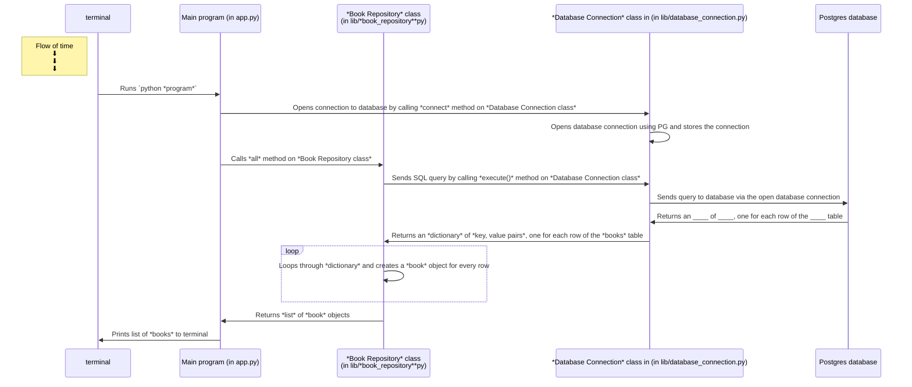

```mermaid

sequenceDiagram
    participant t as terminal
    participant app as Main program (in app.py)
    participant ar as *Book Repository* class <br /> (in lib/*book_repository**py)
    participant db_conn as *Database Connection* class in (in lib/database_connection.py)
    participant db as Postgres database

    Note left of t: Flow of time <br />⬇ <br /> ⬇ <br /> ⬇ 

    t->>app: Runs `python *program*`
    app->>db_conn: Opens connection to database by calling *connect* method on *Database Connection class*
    db_conn->>db_conn: Opens database connection using PG and stores the connection
    app->>ar: Calls *all* method on *Book Repository class*
    ar->>db_conn: Sends SQL query by calling *execute()* method on *Database Connection class*
    db_conn->>db: Sends query to database via the open database connection
    db->>db_conn: Returns an ____ of ____, one for each row of the ____ table

    db_conn->>ar: Returns an *dictionary* of *key, value pairs*, one for each row of the *books* table
    loop 
        ar->>ar: Loops through *dictionary* and creates a *book* object for every row
    end
    ar->>app: Returns *list* of *book* objects
    app->>t: Prints list of *books* to terminal

```